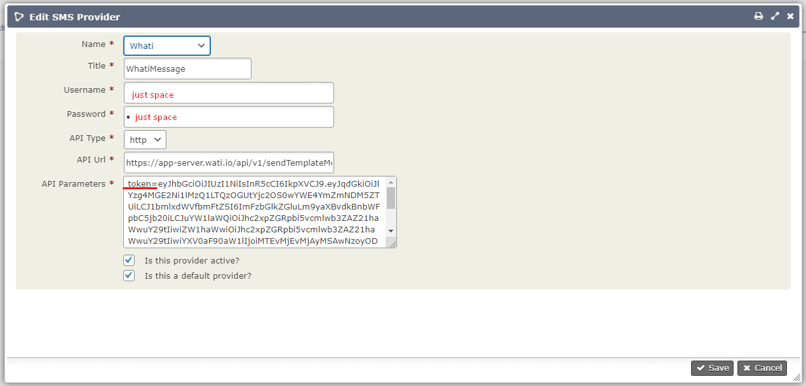

# org.civicrm.sms.whati

## Overview
This extension provides WhatsApp integration with Whati.

You can only send WhatsApp with this extension and not receive messages.

To create an account, go to "https://www.whati.com/", get token and create own message template. 

## Install the extension
You have to unzip the file and place it in "mywebsite/wp-content/uploads/civicrm/ext".

## Setting up the extension

Administer -> System Settings -> SMS Providers

Add SMS Providers

Select the "Whati" from select field.(required)

In the Title field give any title.

In Username field give just type space. (required)

In Password field give the just type space.(required)

In Api Type select "http".(required)

In API URL field give "https://app-server.wati.io/api/v1/sendTemplateMessage". (required)

In the API PARAMETERS, insert "token=" after equal sign put your own account token provided by http://app-server.wati.io.

Leave the case "Active Provider?" checked.

Leave the case "Is this the default provider?" checked.

